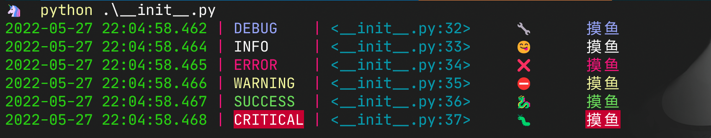

mloguru
==============

simple format logger based on `loguru <https://github.com/Delgan/loguru>`_.

use
-----------------
install from pypi

.. code-block:: python

    pip install mloguru -i https://pypi.python.org/simple/

logger

.. code-block:: python

    from mloguru import logger
    logger.success("hello world!")

preview
-----------------

